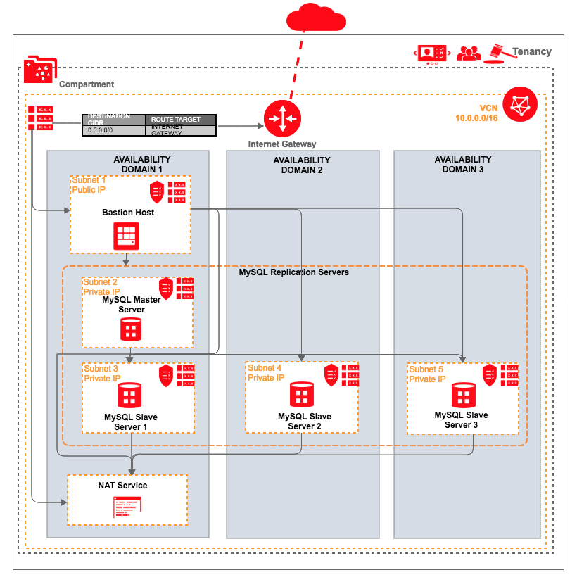

# Oracle Cloud Infrastructure MySQL Terraform Module

These are Terraform modules that deploy [MySQL](https://www.mysql.com/) on [Oracle Cloud Infrastructure (OCI)](https://cloud.oracle.com/en_US/cloud-infrastructure).

## About
The MySQL Oracle Cloud Infrastructure Module provides a Terraform-based MySQL Replication Cluster installation for Oracle Cloud Infrastructure. Replication enables data from one MySQL database server (the master) to be copied to one or more MySQL database servers (the slaves). A MySQL Replication Cluster typically involves one or more master server(s)/instance(s) coupled with one or more slave server(s)/instance(s).



## Prerequisites
1. Download and install Terraform (v0.10.3 or later)
2. Download and install the Oracle Cloud Infrastructure Terraform Provider (v2.0.0 or later)
3. Export Oracle Cloud Infrastructure credentials. (this refer to the https://github.com/oracle/terraform-provider-oci )

## What's a Module?
A Module is a canonical, reusable, best-practices definition for how to run a single piece of infrastructure, such as a database or server cluster. Each Module is created using Terraform, and includes automated tests, examples, and documentation. It is maintained both by the open source community and companies that provide commercial support.
Instead of figuring out the details of how to run a piece of infrastructure from scratch, you can reuse existing code that has been proven in production. And instead of maintaining all that infrastructure code yourself, you can leverage the work of the Module community to pick up infrastructure improvements through a version number bump.

## How to use this Module
Each Module has the following folder structure:
* [root](): This folder contains a root module calls mysql-master and mysql-slave sub-modules to create a MySQL Replication cluster in Oracle Cloud Infrastructure.
* [modules](): This folder contains the reusable code for this Module, broken down into one or more modules.
* [examples](): This folder contains examples of how to use the modules.

The following code shows how to deploy MySQL Replication Cluster using this module:

```hcl
module "mysql-replication-set" {
  source                           = "git::ssh://git@bitbucket.oci.oraclecorp.com:7999/tfs/terraform-oci-mysql.git?ref=dev"
  compartment_ocid                 = "${var.compartment_ocid}"
  master_ad                        = "${var.master_ad}"
  master_subnet_id                 = "${var.master_subnet_id}"
  master_mysql_root_password       = "${var.master_mysql_root_password}"
  master_slaves_replicate_acount   = "${var.master_slaves_replicate_acount}"
  master_slaves_replicate_password = "${var.master_slaves_replicate_password}"
  replicate_master_count           = "${var.replicate_master_count}"
  replicate_slave_count            = "${var.replicate_slave_count}"
  slave_ads                        = "${var.slave_ads}"
  slave_subnet_id                  = "${var.slave_subnet_id}"
  slaves_mysql_root_password       = "${var.slaves_mysql_root_password}"
  ssh_authorized_keys              = "${var.ssh_authorized_keys}"
  ssh_private_key                  = "${var.ssh_private_key}"
  bastion_host                     = "${oci_core_instance.bastion.public_ip}"
  bastion_user                     = "${var.bastion_user}"
  bastion_private_key              = "${var.bastion_private_key}"
}
```

Argument | Description
--- | ---
compartment_ocid | Compartment's OCID where VCN will be created.
label_prefix | To create unique identifier for multiple clusters in a compartment.
master_ad  | The Availability Domain for MySQL master.
master_subnet_id | The OCID of the master subnet to create the VNIC in.
master_display_name | The name of the master instance.
master_image_id | The OCID of an image for a master instance to use. You can refer to https://docs.us-phoenix-1.oraclecloud.com/images/ for more details.
master_shape | The shape to be used on the master instance.
master_mysql_root_password | The password for 'root@localhost' account of the MySQL master server.
master_slaves_replicate_acount | The MySQL replication account for synchronization between the master server and the slave servers.
master_slaves_replicate_password | Password for the MySQL replication account.
replicate_master_count | Number of MySQL master servers to launch.
replicate_slave_count | Number of MySQL slave servers to launch.
slave_ads | The list of Availability Domains for MySQL slave.
slave_subnet_ids | The list of MySQL slave subnets' id.
slave_display_name | The name of the slave instance.
slave_image_id | The OCID of an image for slave instance to use. You can refer to https://docs.us-phoenix-1.oraclecloud.com/images/ for more details.
slave_shape | The shape to be used on the slave instance.
slaves_mysql_root_password | Password for 'root@localhost' account of the MySQL slave servers.
http_port | The port to use for HTTP traffic to MySQL.
ssh_authorized_keys | Public SSH keys path to be included in the ~/.ssh/authorized_keys file for the default user on the instance.
ssh_private_key | The private key path to access instance.
bastion_host | The public ip of bastion instance.
bastion_user | The user of bastion instance.
bastion_private_key | The private key path to access bastion instance.
