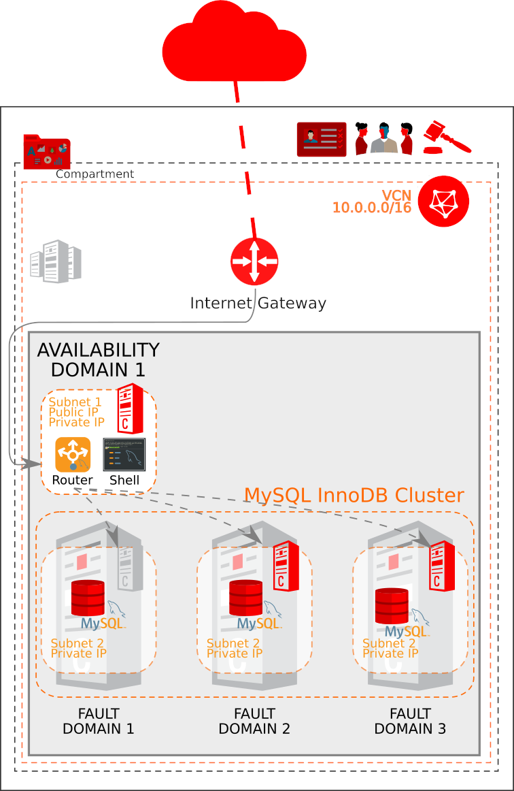

## Create VCN and Deploy MySQL InnoDB Cluster on OCI using multiple Fault Domains in the same Availability Domain (non free trier)

This example creates a VCN in Oracle Cloud Infrastructure including default route table, DHCP options, security list and subnets from scratch, then use terraform_oci_mysql module to deploy a MySQL InnoDB Cluster.This configuration generally implements this:

### Using this example
Update terraform.tfvars with the required information.

### Deploy the cluster  
Initialize Terraform:
```
$ terraform init
```
View what Terraform plans do before actually doing it:
```
$ terraform plan
```
Use Terraform to Provision resources and MySQL Replication Cluster on Oracle Cloud Infrastructure:
```
$ terraform apply
```



